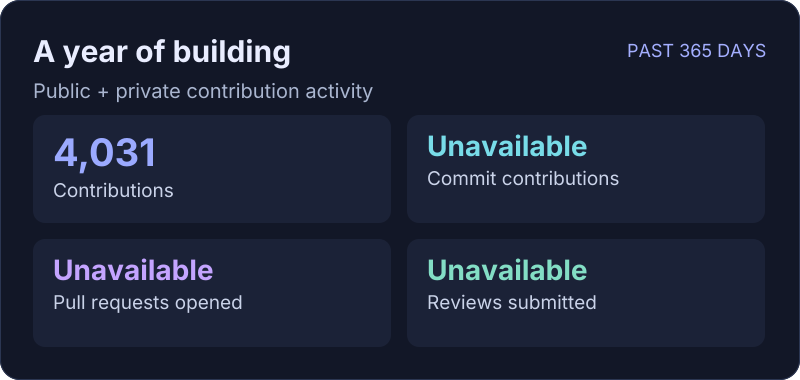
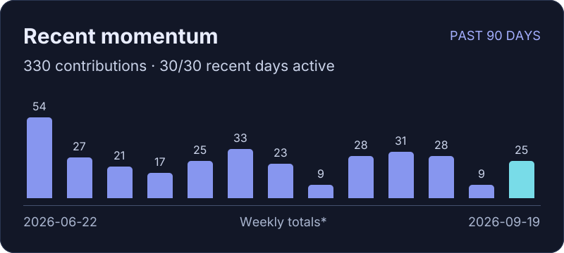
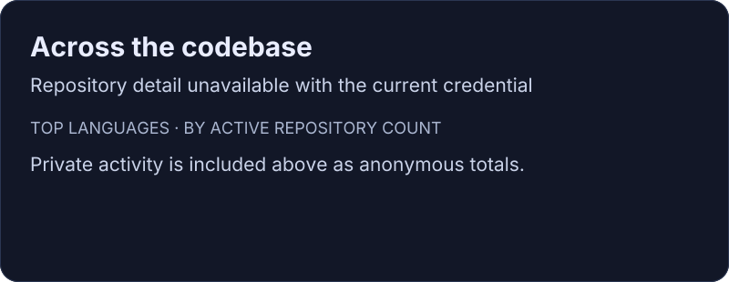

# Scott Gellock

Microsoft Copilot Studio · Conversational AI Platform Engineering

[Website](https://www.gellock.com) · [GitHub](https://github.com/sgellock)

**Reporting period:** 2025-09-20 – 2026-09-19 (365 complete UTC days).

**Last successful refresh:** 2026-09-20 16:39 UTC.

**Coverage:** Public and anonymous private contribution totals are available. Detailed counts and languages are unavailable with the current credential; they are intentionally not shown as zero.

Activity in text

| Metric | Value |
| --- | ---: |
| Contributions | 4,031 |
| Commit contributions | Unavailable |
| Pull requests opened | Unavailable |
| Reviews submitted | Unavailable |
| Active repositories | Unavailable |
| Contributions in the past 90 days | 330 |
| Active days in the past 30 days | 30 |

| Activity period | Contributions |
| --- | ---: |
| 2026-06-22 – 2026-06-27 | 54 |
| 2026-06-28 – 2026-07-04 | 27 |
| 2026-07-05 – 2026-07-11 | 21 |
| 2026-07-12 – 2026-07-18 | 17 |
| 2026-07-19 – 2026-07-25 | 25 |
| 2026-07-26 – 2026-08-01 | 33 |
| 2026-08-02 – 2026-08-08 | 23 |
| 2026-08-09 – 2026-08-15 | 9 |
| 2026-08-16 – 2026-08-22 | 28 |
| 2026-08-23 – 2026-08-29 | 31 |
| 2026-08-30 – 2026-09-05 | 28 |
| 2026-09-06 – 2026-09-12 | 9 |
| 2026-09-13 – 2026-09-19 | 25 |

Language detail unavailable.

How these numbers work

Activity follows GitHub's contribution rules, including qualifying contributions in private repositories. Commit contributions are attributed to my account; they are not a total of everyone’s commits in my repositories. Unmerged feature-branch work may not appear.

Active repositories are the distinct repositories with a qualifying commit, issue, pull request, or review during the reporting period. Language counts use each active repository’s primary language; they do not measure coding time or lines I authored. Repositories without a detected language are omitted from the language list.

*The 90-day chart ends with the last complete UTC day. Its oldest bar covers six days; the remaining bars cover seven days each. The reporting period excludes today’s partial activity.*

Private repository names, links, commit messages, and issue titles are never published. Coverage is limited to the profile history and repositories GitHub makes available to the credential. Inaccessible organizations and deleted history may be absent. A successful response does not prove universal repository coverage.

Generated with [readme-aura](https://github.com/collectioneur/readme-aura) on GitHub Actions. Images live in this repository. If a refresh fails, the last successful version stays visible.

